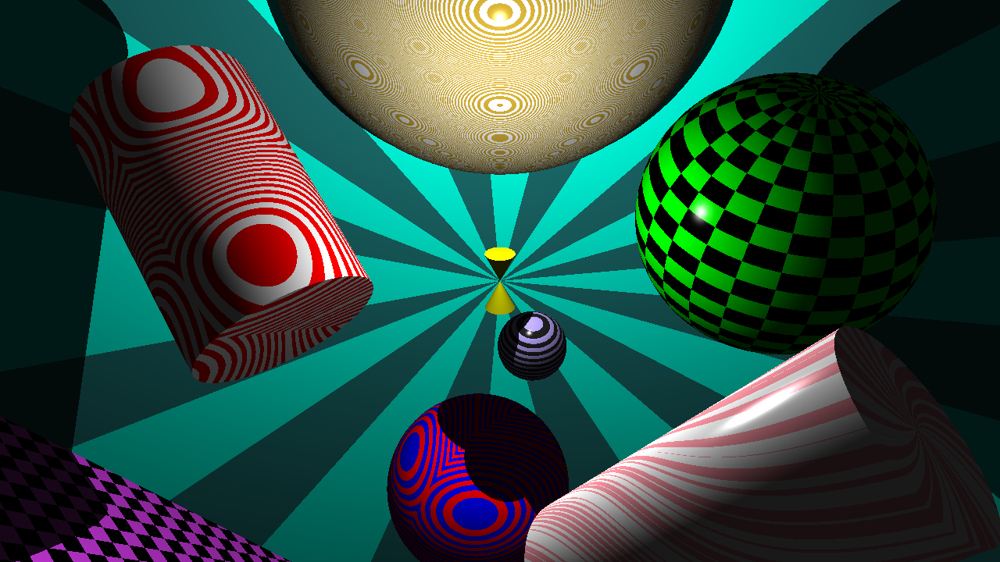
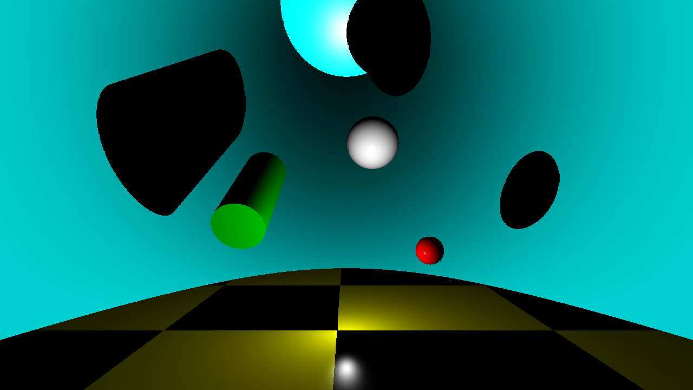
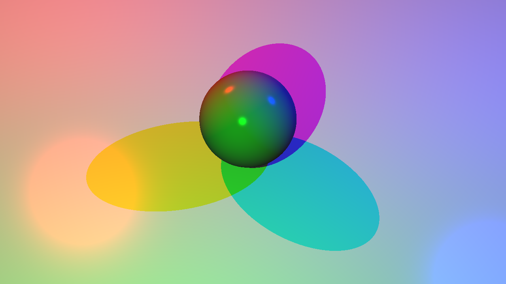
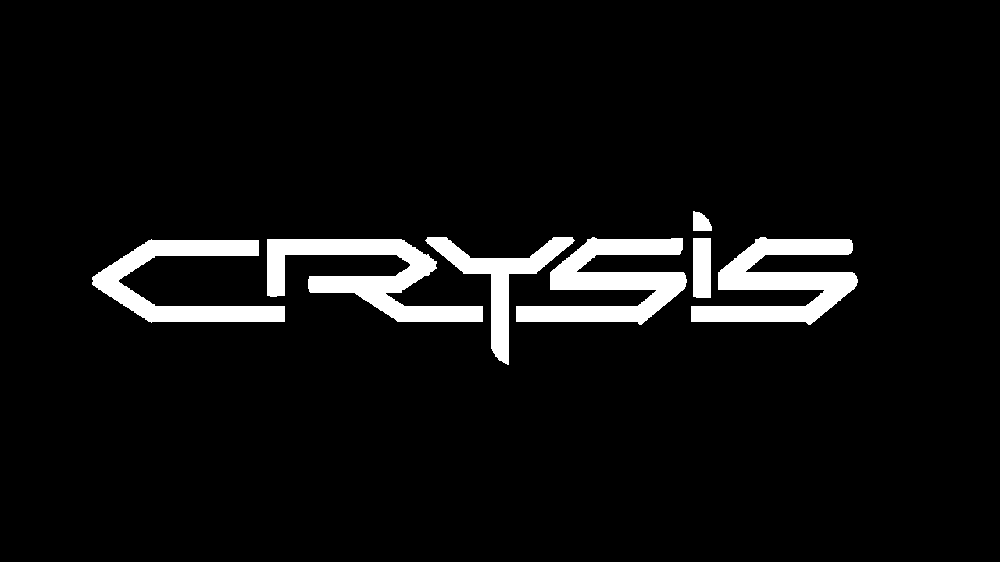

# MINIRT

My 10th project at 42 Network's Hive Helsinki 🐝

Simulating rays of light to render beautiful interactive scenes

https://raw.githubusercontent.com/EvAvKein/hive_minirt/57e734a1a1ce6a9a0d2fab403bba94e3edee3058/README_assets/compilation.mp4

<div style="padding-top: 1.4em; display: flex; flex-wrap: wrap; justify-content: space-between">
    <div style="flex-basis: 48%">
        
        <p>eve_wallpaper.rt</p>
    </div>
    <div style="flex-basis: 48%">
        
        <p>inside_cylinder.rt</p>
    </div>
    <div style="flex-basis: 48%">
        
        <p>multicolored_lights_01.rt</p>
    </div>
    <div style="flex-basis: 48%">
        
        <p>crysis.rt</p>
    </div>
</div>

> [!TIP]
> If you're at a 42 school and doing this project: It's genuinely so much better to ask fellow students instead of reading online solutions ✨

---

## Description

This project's about raytracing, with the following base features:
- Parsing a scene (*.rt) file
- Scene validation
    - Has to have:
        - One point light
        - One ambient light
        - One camera
    - Can have:
        - Spheres
        - Planes
        - Cylinders
- Rendering a scene
    - Phong ambient & diffuse lighing model
    - Shadows cast by objects

We also wanted to create additional features for our own satisfaction and further learning:
- Optional project bonuses
    - Multicolored lights
    - Multiple point lights in the same scene
    - Extra 2nd-degree object (cone)
    - Specular highlights
    - Checkerboard pattern
- Additional extras
    - User inputs
        - Changing the viewpoint and object transforms (position, orientation, scale, FOV) live within the loaded scene
        - Toggling caps for cylinders and cones
        - Camera and object position and orientation upon manipulation
        - Resetting of camera and object transforms
        - Taking a screenshot of the current view
        - Window resizing with adaptive render region size
    - Extra patterns
    - Extra triangle object
    - Texture mapping onto objects and skybox
    - Multithreading for rendering optimization
    - Gradual rendering for faster viewport response
    - Scene file comments
    - Isolated testing for single objects

## Installation

Dependencies:
- glfw

Run `make` or `make optimized` inside the repository root folder. The optimized rule uses several optimization flags.

In settings.h it is possible to set/control:
- Initial window resolution
- Input mappings
- Camera and object tranformation speeds
- Thread count
- Initial rendering precision
- Maximum rendering distance

## Usage

> [!NOTE]
> Code was written and tested for Linux (using Hive's Ubuntu iMacs)

```./miniRT <path/to/scene_file.rt>```

Example scene files can be found in the folder `scenes` inside the root repository folder. Refer to the example
scenes for possible scene file entries (additionnal patterns, textures, parameters).

Recommended scenes:
- eve_wallpaper.rt
- incantation.rt
- stargate.rt
- crysis.rt
- triangles.rt

---

## Credits

- [Eve Keinan](https://github.com/EvAvKein)
- [Johnny Varila](https://github.com/zoni527)
- 360 textures: [PolyHaven](https://polyhaven.com/hdris)
- Portrait photos: [Uliana Nadorozhna](https://www.instagram.com/nadorozhna_uliana/)
